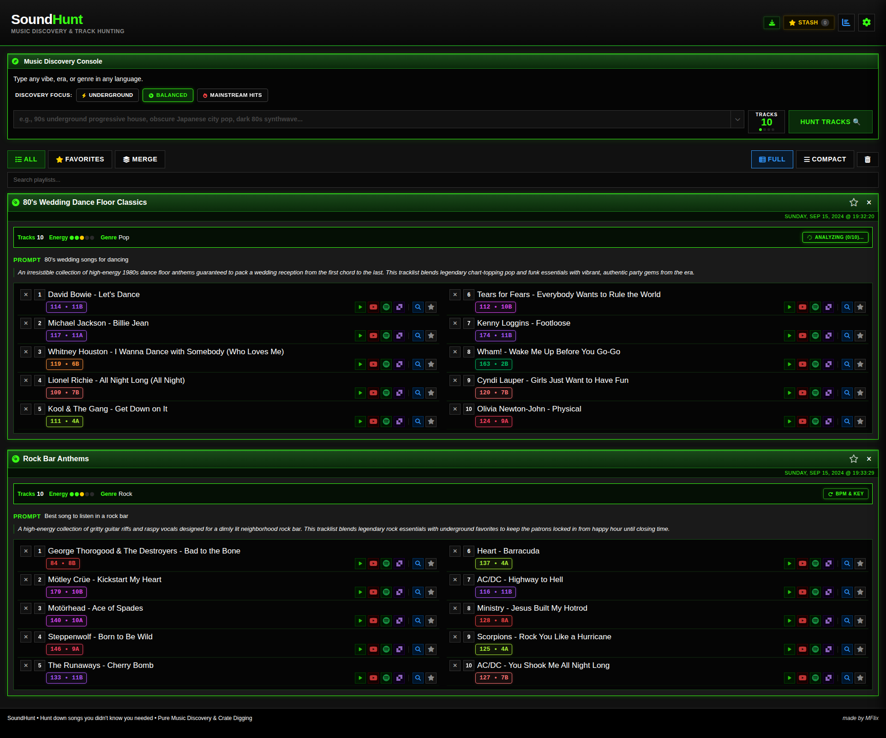
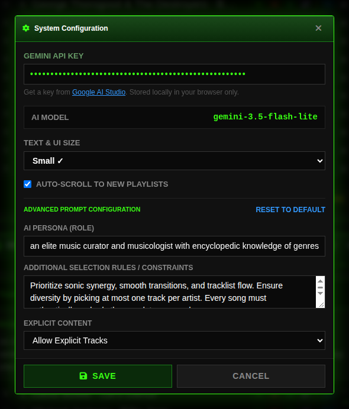

# MegamixGen `v0.1-beta`

> **Browser-based DJ setlist curation, harmonic transition planning, and BPM progression sorting.**

MegamixGen helps DJs design cohesive track sequences based on eras, genres, or moods, then analyzes and organizes them for seamless mixing using standard **Camelot Wheel** notation and tempo progressions.

> [!IMPORTANT]
> **Work in Progress (v0.1 Beta Preview)**  
> MegamixGen is currently in active development. While core playlist curation, Camelot conversion, and API verification are fully functional, please note that **BPM and musical key data** queried from third-party catalogs and AI curation are community-sourced or algorithmic estimates. Values may occasionally differ from vinyl/master recordings, pitch-adjusted tracks, or remixes and are not guaranteed to be 100% accurate. Always verify with your ears and DJ software beatgrid analysis when performing live!

---

## Interface Preview

### Main Curation & Setlist View


### Settings & API Configuration


---

## Why MegamixGen?

Building setlists and planning megamixes often requires bouncing between streaming platforms, search engines, and DJ software:

- **The Challenge**: Relying on guesswork or unverified tags leads to clashing keys and awkward tempo jumps during live mixing.
- **The Solution**: MegamixGen unifies track curation, **harmonic key matching**, and **authoritative tempo verification** into a single, focused interface.

---

## Features

- **Harmonic Key Matching**: Automatically maps songs to standard Serato `Camelot Wheel` notation (`1A`–`12B`) and `Open Key` (`1d`–`12m`) to identify compatible harmonic transitions.
- **BPM Transition Curves**: Sort playlists by tempo progression (`Low to High` / `High to Low`), energy ramps, or harmonic flow.
- **Authoritative Verification**: Queries verified song catalogs via the `GetSongBPM API` to confirm true BPM and musical key without guessing.
- **Local Browser Cache**: Verified song data persists in `localStorage`, eliminating redundant network requests and speeding up repeat queries.
- **Quick Previews & Export**: Jump directly to search queries on `YouTube` and `Spotify`, or copy clean tracklists formatted for DJ library preparation.

---

## Getting Started

### Running Locally
1. **Clone or download the repository**:
   ```bash
   git clone https://github.com/marceloflix/MegamixGen.git
   cd MegamixGen
   ```

2. **Start the local server**:
   ```bash
   python3 server.py
   ```

3. **Open the application**:
   Open `http://localhost:8080` in your web browser.

---

### Obtaining Free API Keys

MegamixGen uses two free APIs. You can easily get your own keys with zero cost:

#### 1. Gemini API Key (Curation & Track Suggestions)
1. Head to [Google AI Studio](https://aistudio.google.com/apikey).
2. Sign in with your Google account and click **Create API key**.
3. Paste the key in MegamixGen under **Settings** → **Gemini API Key**.

#### 2. GetSongBPM API Key (Authoritative BPM & Camelot Keys)
1. Open the [GetSongBPM API Registration Page](https://getsongbpm.com/api).
2. Fill out the request form using this public repository URL for verification:
   - **Website URL or App ID/Package Name**: `https://github.com/marceloflix/MegamixGen`
   - **Backlink URL**: `https://github.com/marceloflix/MegamixGen`
   - **Email**: Enter your real personal or developer email address.
3. Submit the form. GetSongBPM's automated verification will scan this repository, confirm the attribution backlink, and email you a free API key.
4. Paste the key in MegamixGen under **Settings** → **GetSongBPM API Key** and click **Save**.

> [!TIP]
> Both keys are stored locally in your browser (`localStorage`). They are never shared, uploaded, or transmitted to any external third party.

---

> [!NOTE]
> **Desktop App Roadmap**: A standalone, double-click desktop executable is planned for upcoming releases to make launching MegamixGen effortless without requiring terminal commands.

---

## Data Attribution

BPM and musical key database queries are provided by [GetSongBPM](https://getsongbpm.com).

---

## License

Distributed under the **MIT License**.
